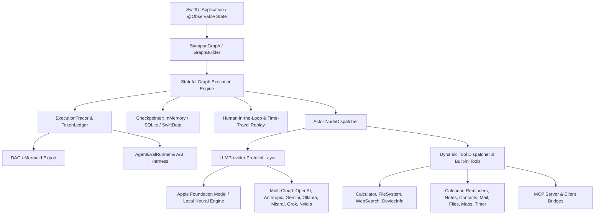

# SynapseAgent (synapse-agent-swift)

<p align="center">
  
  
  
  
  
</p>

**SynapseAgent** is an open-source, high-performance, native Swift framework designed to construct stateful, multi-actor, resilient AI agents exclusively on Apple platforms (**iOS 27.0+, iPadOS 27.0+, macOS 27.0+, visionOS 27.0+**, and newer).

Inspired by the cyclic execution flow of LangGraph and the native ergonomics of SwiftAgent, SynapseAgent brings production-grade agentic orchestration into the Apple ecosystem with on-device execution, zero forced cloud dependency, first-class Apple Foundation Model integration, and a unified external provider layer (OpenAI, Anthropic, Gemini, Ollama, Mistral, Grok, Nvidia).

---

## 📊 Comprehensive Feature Comparison Matrix

| Architectural Feature | SynapseAgent (Native Swift) | LangGraph (Python / JS) | Microsoft AutoGen / SK | SwiftAgent (Community) |
| :--- | :---: | :---: | :---: | :---: |
| **Native Apple Platforms (iOS 27+, macOS 27+, visionOS 27+)** | ✅ | ❌ | ❌ | ❌ |
| **100% On-Device First (Zero Forced Cloud)** | ✅ | ❌ | ❌ | ❌ |
| **Swift 6 Strict Concurrency (Data-Race Free Actors)** | ✅ | ❌ | ❌ | ❌ |
| **Compile-Time Type-Safe State Graphs** | ✅ | ❌ | ❌ | ❌ |
| **First-Class Apple Foundation Model Local Bindings** | ✅ | ❌ | ❌ | ❌ |
| **Hardware Accelerated Local Inference (Apple Silicon / Metal)** | ✅ | ❌ | ❌ | ❌ |
| **Cyclic Graph & Loop Execution Engine** | ✅ | ✅ | ❌ | ❌ |
| **State Persistence via SwiftData & Embedded SQLite3** | ✅ | ❌ | ❌ | ❌ |
| **Time-Travel State Replay & Historical Forking** | ✅ | ✅ | ❌ | ❌ |
| **Human-in-the-Loop Interrupts & Thread Resumption** | ✅ | ✅ | ❌ | ❌ |
| **Multi-Agent Supervisor & Swarm Handoff Routing** | ✅ | ✅ | ✅ | ❌ |
| **Dynamic Tool Dispatcher with JSON Schema Validation** | ✅ | ✅ | ✅ | ❌ |
| **Native SwiftUI `@Observable` State & UI Components** | ✅ | ❌ | ❌ | ❌ |
| **Universal Multi-Cloud Fallback (OpenAI, Claude, Gemini, Ollama)** | ✅ | ✅ | ✅ | ❌ |
| **Zero-Cloud Air-Gapped Network Enforcement** | ✅ | ❌ | ❌ | ❌ |
| **Secure Apple Keychain API Credential Management** | ✅ | ❌ | ❌ | ❌ |
| **Pre-Flight Automatic PII Sanitizer Middleware** | ✅ | ❌ | ❌ | ❌ |
| **Zero Heavy C / Python / Bridge Dependencies** | ✅ | ❌ | ❌ | ❌ |
| **Execution Tracing & DAG Visualization** | ✅ | ✅ | ❌ | ❌ |
| **Token Cost Accounting (All Major Providers)** | ✅ | ✅ | ❌ | ❌ |
| **Agent Evaluation & Regression Harness** | ✅ | ✅ LangSmith | ❌ | ❌ |
| **A/B Testing Harness for Agent Variants** | ✅ | ✅ LangSmith | ❌ | ❌ |
| **Pre-Built Apple Platform Tools (Calendar, Mail, Notes, etc.)** | ✅ | ❌ | ❌ | ❌ |
| **MCP (Model Context Protocol) Server & Client Bridges** | ✅ | ✅ | ❌ | ❌ |

---

## 🏗 Architectural Overview



---

## 🌌 The Synapse Ecosystem Suite

SynapseAgent seamlessly orchestrates the full suite of native Apple AI frameworks:

| Subsystem | Framework | Capability Provided |
| :--- | :--- | :--- |
| **🧠 Memory** | [`synapse-memory-swift`](https://github.com/VM451/synapse-memory-swift) | Bi-temporal Knowledge Graphs, SIMD Vector Search, Working Core Memory, CloudKit Sync |
| **🧪 Sandbox** | [`synapse-sandbox-swift`](https://github.com/VM451/synapse-sandbox-swift) | Zero-trust WebKit/WASM Engine, Token-Optimized Semantic DOM Dumps, Sub-ms Code Patching |
| **🔍 Search** | [`synapse-search-swift`](https://github.com/VM451/synapse-search-swift) | 100% On-Device Stealth Search, JS Web Scraping, AFM Structured Data Extraction |

Register all ecosystem capabilities in one line:
```swift
let registry = ToolRegistry()
registry.registerAllEcosystemCapabilities()
```

---

## ⚡ 30-Second Quickstart

```swift
import SynapseAgent

// 1. Define State
struct AssistantState: AgentState {
    var query: String = ""
    var response: String = ""
}

// 2. Build Cyclic Graph
let builder = GraphBuilder<AssistantState>()
builder.addNode("think") { state in
    let provider = AppleFoundationModelProvider.default
    let res = try await provider.generate(prompt: [.user(state.query)])
    var updated = state
    updated.response = res.text
    return updated
}
builder.setEntryPoint("think")
builder.addEdge(from: "think", to: EndNode.id)

// 3. Compile & Run with SQLite Checkpointer
let graph = builder.compile(checkpointer: SQLiteCheckpointer())
let finalState = try await graph.invoke(initialState: AssistantState(query: "Hello on-device AI!"))
print(finalState.response)
```

---

## 📖 In-Depth Documentation

For granular guides and comprehensive API references, see the **[`docs/`](docs/)** directory:

- 🌌 **[Ecosystem Integration Guide](docs/synapse-ecosystem-integration.md)**: Unifying SynapseAgent with Memory, Sandbox, and Search.
- 🚀 **[Getting Started & Installation](docs/getting-started.md)**: Setup, SPM integration, and lifecycle streaming.
- 🏛 **[Architecture & Design](docs/architecture-and-design.md)**: Swift 6 strict concurrency, actor isolation, and cyclic data flow.
- 🔄 **[Core Graph Engine & State Reducers](docs/core-graph-engine.md)**: Nodes, direct edges, conditional routing, branching, and state reducers.
- 🤖 **[Providers & Foundation Models](docs/providers-and-models.md)**: Apple Foundation Models, OpenAI, Anthropic, Gemini, Ollama, Mistral, Grok, Nvidia NIM.
- 💾 **[State Persistence & Time Travel](docs/state-persistence-and-time-travel.md)**: SwiftData, SQLite, InMemory checkpointers, state inspection, and thread forking.
- 🛑 **[Human-in-the-Loop & Interrupts](docs/human-in-the-loop-and-interrupts.md)**: Safe action pausing, approval banners, and thread resumption.
- 🤝 **[Multi-Agent Orchestration](docs/multi-agent-orchestration.md)**: Subgraph nesting, supervisor routing, swarm handoffs, and parallel task groups.
- 🛠 **[Tools & Dynamic Tool Dispatcher](docs/tools-and-dispatcher.md)**: Tool definitions, JSON schemas, calculator, filesystem, Apple Platform tools, and MCP connectors.
- 🍎 **[Apple Platform Pre-Built Tools](docs/apple-platform-tools.md)**: Calendar, Reminders, Notes, Contacts, Mail, Files, Maps, SystemControl, and Timer tools with Mock & Native providers.
- 🔭 **[Observability & Execution Tracing](docs/observability-and-tracing.md)**: Hierarchical span tracing, ASCII DAG rendering, Mermaid diagrams, token ledger, and cost attribution per node and tool.
- 📊 **[Evaluation & A/B Testing](docs/evaluation-and-testing.md)**: Regression test harness, eval metrics (Contains, ToolCallSequence, LatencySLA, CostBudget, LLMAsJudge), and A/B experiment comparison.
- 🔌 **[MCP Integration Guide](docs/mcp-integration.md)**: MCPToolAdapter, MCPServerBridge, and MCPClientBridge for interoperating with external MCP servers.
- 🛡 **[Security & Privacy Guardrails](docs/security-and-privacy.md)**: Zero-cloud mode, Keychain credential management, and PII sanitization.
- 📱 **[SwiftUI Native Integration](docs/swiftui-integration.md)**: `@Observable` `AgentViewModel`, chat interfaces, approval banners, and timeline scrubbers.

---

## 🧪 Testing

SynapseAgent ships with **45 tests across 16 suites** covering the full stack — graph engine, HITL, multi-agent orchestration, observability, evaluation, Apple Platform tools, MCP bridges, and security guardrails. All tests are 100% data-race free under Swift 6 strict concurrency:

```bash
swift test --disable-sandbox
```

---

## 📄 License

MIT License. Built with ❤️ for the Apple AI Developer community.
