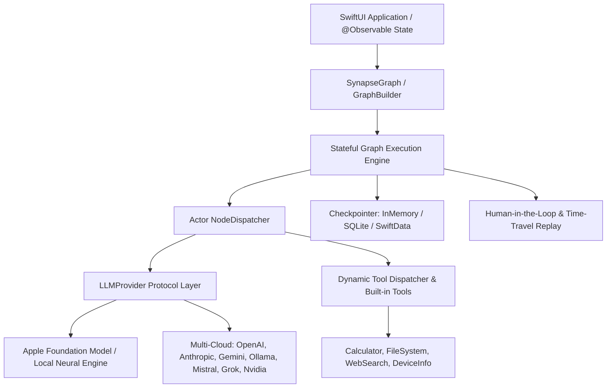

# SynapseAgent (synapse-agent-swift)

<p align="center">
  
  
  
  
  
</p>

**SynapseAgent** is an open-source, high-performance, native Swift framework designed to construct stateful, multi-actor, resilient AI agents on Apple platforms (iOS, iPadOS, macOS, visionOS).

Inspired by the cyclic execution flow of LangGraph and the native ergonomics of SwiftAgent, SynapseAgent brings production-grade agentic orchestration into the Apple ecosystem with on-device execution, zero forced cloud dependency, first-class Apple Foundation Model integration, and a unified external provider layer (OpenAI, Anthropic, Gemini, Ollama, Mistral, Grok, Nvidia).

---

## 📊 Competitive Matrix

| Feature | LangGraph (Python / JS) | SwiftAgent (Community) | SynapseAgent (synapse-agent-swift) |
| :--- | :--- | :--- | :--- |
| **Target Platforms** | Server / Backend / Node.js | iOS (Basic Wrappers) | **iOS / iPadOS / macOS / visionOS (Native Apple)** |
| **Type Safety** | Dynamic / Partial (Pydantic) | Typed | **Strict Compile-Time Swift 6 Type Safety** |
| **Concurrency Safety** | Thread Locking / GIL | Partial Concurrency | **100% Data-Race Free Actor Isolation** |
| **On-Device First** | ❌ (Cloud / Server Focus) | ⚠️ (Partial) | **✅ 100% Zero-Cloud Local Native** |
| **Apple Models** | Python Bridge Required | Basic | **First-Class System Foundation Model Binding** |
| **State Persistence** | Postgres / Redis / Memory | In-Memory | **SwiftData / SQLite / Checkpointing** |
| **Time-Travel & Replay**| Server Replay | ❌ | **Native Time-Travel State Replay Engine** |
| **Human-in-the-Loop** | Callback Endpoints | ❌ | **Native Pause / Resume Interrupt Engine** |
| **SwiftUI Integration** | ❌ | Basic | **Native `@Observable` SwiftUI State Bindings** |
| **Zero Heavy C/Python**| Heavy C / Python Runtime | C++ Wrapper | **Pure Native Swift Framework** |

---

## 🏗 Architectural Overview



---

## ⚡ 30-Second Quickstart

```swift
import SynapseAgent

// 1. Define State
struct AssistantState: AgentState {
    var query: String = ""
    var response: String = ""
}

// 2. Build Cyclic Graph
let builder = GraphBuilder<AssistantState>()
builder.addNode("think") { state in
    let provider = AppleFoundationModelProvider.default
    let res = try await provider.generate(prompt: [.user(state.query)])
    var updated = state
    updated.response = res.text
    return updated
}
builder.setEntryPoint("think")
builder.addEdge(from: "think", to: EndNode.id)

// 3. Compile & Run with SQLite Checkpointer
let graph = builder.compile(checkpointer: SQLiteCheckpointer())
let finalState = try await graph.invoke(initialState: AssistantState(query: "Hello on-device AI!"))
print(finalState.response)
```

---

## 📖 In-Depth Documentation

For granular guides and comprehensive API references, see the **[`docs/`](docs/)** directory:

- 🚀 **[Getting Started & Installation](docs/getting-started.md)**: Setup, SPM integration, and lifecycle streaming.
- 🏛 **[Architecture & Design](docs/architecture-and-design.md)**: Swift 6 strict concurrency, actor isolation, and cyclic data flow.
- 🔄 **[Core Graph Engine & State Reducers](docs/core-graph-engine.md)**: Nodes, direct edges, conditional routing, branching, and state reducers.
- 🤖 **[Providers & Foundation Models](docs/providers-and-models.md)**: Apple Foundation Models, OpenAI, Anthropic, Gemini, Ollama, Mistral, Grok, Nvidia NIM.
- 💾 **[State Persistence & Time Travel](docs/state-persistence-and-time-travel.md)**: SwiftData, SQLite, InMemory checkpointers, state inspection, and thread forking.
- 🛑 **[Human-in-the-Loop & Interrupts](docs/human-in-the-loop-and-interrupts.md)**: Safe action pausing, approval banners, and thread resumption.
- 🤝 **[Multi-Agent Orchestration](docs/multi-agent-orchestration.md)**: Subgraph nesting, supervisor routing, swarm handoffs, and parallel task groups.
- 🛠 **[Tools & Dynamic Tool Dispatcher](docs/tools-and-dispatcher.md)**: Tool definitions, JSON schemas, calculator, filesystem, and telemetry tools.
- 🛡 **[Security & Privacy Guardrails](docs/security-and-privacy.md)**: Zero-cloud mode, Keychain credential management, and PII sanitization.
- 📱 **[SwiftUI Native Integration](docs/swiftui-integration.md)**: `@Observable` `AgentViewModel`, chat interfaces, approval banners, and timeline scrubbers.

---

## 🧪 Testing

SynapseAgent features a test suite with 100% data-race free Swift 6 strict concurrency verification:

```bash
swift test --disable-sandbox
```

---

## 📄 License

MIT License. Built with ❤️ for the Apple AI Developer community.
