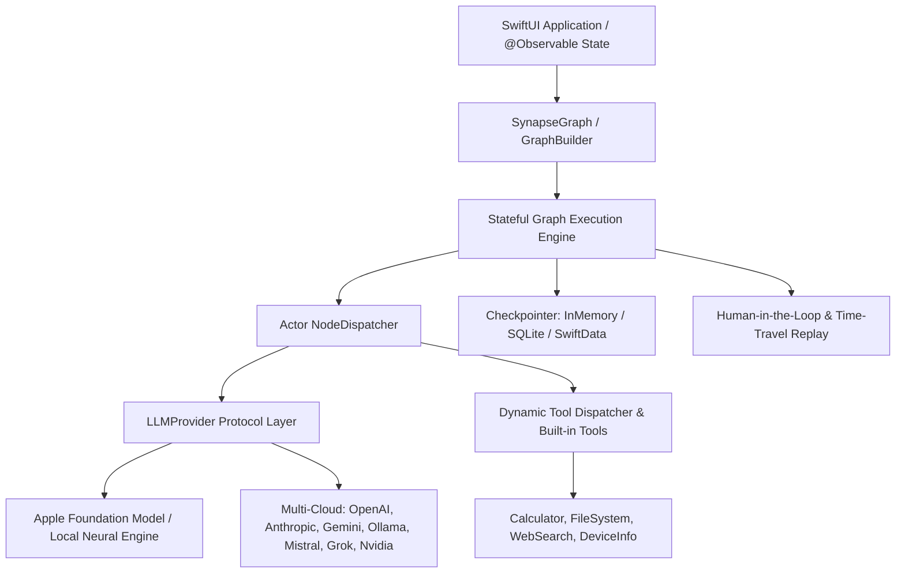

# SynapseAgent (synapse-agent-swift)

<p align="center">
  
  
  
  
  
</p>

**synapse-agent-swift** (`SynapseAgent`) is a high-performance, native Swift framework designed to construct stateful, multi-actor, resilient AI agents on Apple platforms (iOS, iPadOS, macOS, visionOS).

Inspired by the cyclic execution flow of LangGraph and the native ergonomics of SwiftAgent, SynapseAgent brings production-grade agentic orchestration into the Apple ecosystem. It prioritizes on-device execution, zero forced cloud dependency, and first-class integration with Apple Foundation Models, while maintaining a unified adapter layer for external cloud providers (OpenAI, Anthropic, Google Gemini, Ollama, Mistral, Grok, Nvidia).

---

## 🌟 Core Principles

1. **100% On-Device First**: Core state graphs, persistence engines, tool dispatchers, and memory operate locally without mandatory external servers.
2. **First-Class Apple Foundation Model Integration**: Zero-friction bindings for local Apple Foundation Models with hardware acceleration.
3. **Resilience & Fault Tolerance**: Native support for cyclic workflows, retries, fallback routing, human-in-the-loop interrupts, and checkpoint state restoration.
4. **Swift 6 Strict Concurrency & Safety**: 100% data-race free actor-isolated state machine, `@Sendable` state snapshots, and compile-time schema validation.
5. **Zero Heavy C/Python Dependencies**: Pure Swift built entirely with Apple framework primitives (Foundation, SwiftData, SQLite3, Metal, NaturalLanguage, Combine, Observation).

---

## 🏗 System Architecture



---

## 🚀 Quick Start

### 1. Define Agent State
```swift
import SynapseAgent

struct CodeAssistantState: AgentState {
    var messages: [ChatMessage] = []
    var draftCode: String = ""
    var executionResult: String?
    var isApproved: Bool = false
}
```

### 2. Build the Cyclic Graph
```swift
let builder = GraphBuilder<CodeAssistantState>()

// Node 1: Code Generator (Apple Foundation Model or Cloud)
builder.addNode("generator") { state in
    let provider = AppleFoundationModelProvider.default
    let response = try await provider.generate(prompt: state.messages)
    var nextState = state
    nextState.draftCode = response.text
    nextState.messages.append(.assistant(response.text))
    return nextState
}

// Node 2: Local Verifier & Static Analysis
builder.addNode("verifier") { state in
    var nextState = state
    nextState.executionResult = state.draftCode.contains("func") ? "SUCCESS" : "RETRY"
    return nextState
}

// Node 3: Human-in-the-Loop Interrupt
builder.addNode("humanReview") { (state: CodeAssistantState) in
    throw GraphInterrupt.approvalRequired(message: "Approve generated code execution?")
}

// Define Transitions
builder.setEntryPoint("generator")
builder.addEdge(from: "generator", to: "verifier")

// Cyclic Conditional Edge
builder.addConditionalEdge(from: "verifier") { state in
    state.executionResult == "SUCCESS" ? "humanReview" : "generator"
}
builder.addEdge(from: "humanReview", to: EndNode.id)

// Compile with SQLite Checkpointing
let checkpointer = SQLiteCheckpointer()
let graph = builder.compile(checkpointer: checkpointer)
```

### 3. Execute & Stream Events
```swift
// Synchronous invocation
let finalState = try await graph.invoke(initialState: CodeAssistantState())

// Or stream real-time lifecycle events
for try await event in graph.stream(initialState: CodeAssistantState()) {
    switch event {
    case .nodeStarted(let id, _, let step):
        print("▶ Running node \(id) at step \(step)")
    case .nodeCompleted(let id, _, let duration, _):
        print("✔ Finished node \(id) in \(duration)s")
    case .interrupted(let interrupt, _, _):
        print("⚠️ Human approval required: \(interrupt.message)")
    case .completed(let state, let totalSteps):
        print("🎉 Agent finished in \(totalSteps) steps!")
    default:
        break
    }
}
```

---

## 🛡 Security & Privacy Guardrails

Enforce zero external network egress with a single flag:
```swift
// Blocks all external HTTP/WebSocket network calls
ZeroCloudMode.isEnabled = true
```

Secure Keychain Storage for API credentials:
```swift
let keychain = KeychainStorage(service: "com.myapp.ai.keys")
try keychain.save(key: "OPENAI_API_KEY", value: "sk-...")
```

PII Sanitization Middleware:
```swift
let cleanPrompt = PIISanitizer.sanitize(text: userPrompt)
```

---

## 📦 Supported Providers

| Provider | Supported Models | Streaming | Tool Calling | Offline |
| :--- | :--- | :---: | :---: | :---: |
| **Apple Foundation Model** | Native Apple On-Device Models | ✅ | ✅ | ✅ |
| **OpenAI** | GPT-4o, o1, o3-mini, GPT-4o-mini | ✅ | ✅ | ❌ |
| **Anthropic** | Claude 3.5 Sonnet, Haiku, Opus | ✅ | ✅ | ❌ |
| **Google Gemini** | Gemini 1.5 Pro, Flash, Gemini 2.0 Flash | ✅ | ✅ | ❌ |
| **Ollama / Local Llama** | Llama 3.3, DeepSeek-R1, Mistral GGUF | ✅ | ✅ | ✅ |
| **Mistral AI** | Mistral Large, Codestral, Pixtral | ✅ | ✅ | ❌ |
| **xAI Grok** | Grok-2, Grok-beta | ✅ | ✅ | ❌ |
| **NVIDIA NIM** | TensorRT-LLM Microservices | ✅ | ✅ | ❌ |

---

## 🧪 Testing

SynapseAgent is built with Swift Testing (`import Testing`, `@Suite`, `@Test`, `#expect`):

```bash
swift test --disable-sandbox
```

---

## 📄 License

MIT License. Designed with ❤️ for the Apple Developer & AI community.
