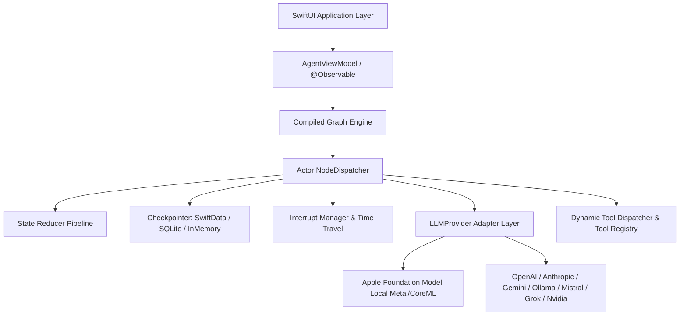

# Architecture & Design

`SynapseAgent` is designed from the ground up to bring cyclic, stateful multi-actor workflows to Apple platforms without relying on Python bridges, server gateways, or heavy C/C++ runtimes.

---

## 🏛 System Overview

---

## 🔒 Swift 6 Strict Concurrency & Actor Isolation

### Complete Thread Safety
`SynapseAgent` is 100% compliant with `-strict-concurrency=complete`:
- **State Immutability**: All states passed through nodes are value types conforming to `AgentState: Codable, Sendable, Equatable`.
- **Actor-Isolated Runtime**: Graph dispatching is managed inside `actor NodeDispatcher<State>`, eliminating lock contention and data races across background tasks and UI threads.
- **Checked Task Boundaries**: Long-running loops, parallel branch tasks, and event streaming handle cooperative cancellation safely via `Task.checkCancellation()`.

---

## 🔁 Cyclic Graph Dataflow

Unlike directed acyclic graph (DAG) pipelines, `SynapseAgent` allows nodes to form arbitrary execution loops. This facilitates:
1. **Self-Correcting Code Generation**: Generate -> Run Linter -> Detect Error -> Loop back to Generator.
2. **Iterative Search & Refinement**: Search -> Evaluate Quality -> Fetch Missing References -> Loop back.
3. **Multi-Agent Debates**: Agent A drafts -> Agent B critiques -> Agent A modifies -> Loop until consensus reached.

### Recursion Guard
To prevent accidental infinite loops, `Graph` enforces a configurable `maxRecursionDepth` (default: 50). If the counter exceeds the limit, the engine throws `GraphError.recursionLimitExceeded` safely before freezing resources.
