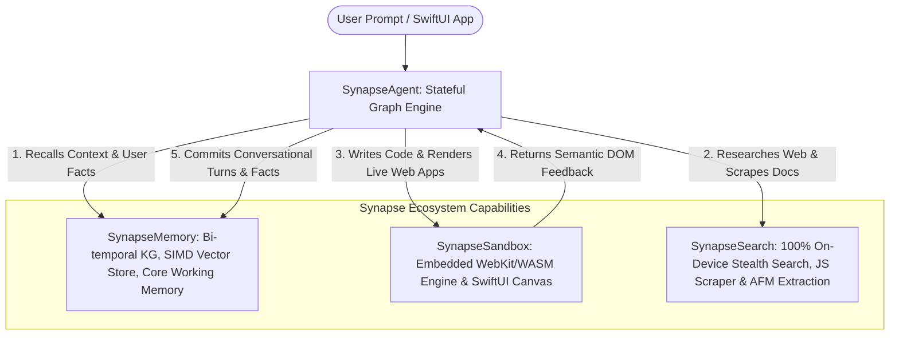

# Synapse Apple AI Ecosystem Integration Guide

This guide details how to build complete, stateful, multi-capability AI agents on Apple platforms by combining **SynapseAgent** with **SynapseMemory**, **SynapseSandbox**, and **SynapseSearch**.

---

## 🏛️ Ecosystem Architectural Overview

The Synapse ecosystem is architected around four native, zero-dependency Swift libraries engineered exclusively for Apple Silicon:



---

## 📦 Packages in the Ecosystem

| Package | Purpose | Core Technology |
| :--- | :--- | :--- |
| **`SynapseAgent`** | Cyclic Graph Execution, Supervisors, Human-in-the-Loop, Checkpointing | Swift 6 Concurrency, Actors, SQLite3 / SwiftData |
| **`SynapseMemory`** | Long-Term Semantic Memory, Bi-temporal Knowledge Graph, Working Memory | Accelerate `vDSP`, SQLite FTS5, CloudKit Sync |
| **`SynapseSandbox`** | Isolated Code Playground, Semantic DOM Extraction, Hot Reload Canvas | WebKit, `sandbox://app/` Scheme, SwiftUI |
| **`SynapseSearch`** | On-Device Stealth Search, Off-Screen JS Scraping, Structured Extraction | `URLSession`, Apple Foundation Models, SwiftData |

---

## 🚀 Unified 60-Second Quickstart

```swift
import SwiftUI
import SynapseAgent

// 1. Initialize Tool Registry with the Full Ecosystem Suite
let registry = ToolRegistry()
registry.registerAllEcosystemCapabilities()

let dispatcher = ToolDispatcher(registry: registry)

// 2. Define Stateful Agent State
struct ResearchAndBuildState: AgentState {
    var userGoal: String = ""
    var memoryContext: String = ""
    var researchSummary: String = ""
    var liveDOM: String = ""
    var response: String = ""
}

// 3. Build Cyclic Multi-Stage Graph
let builder = GraphBuilder<ResearchAndBuildState>()

// Node 1: Query Long-Term Memory
builder.addNode("recallMemory") { state in
    var updated = state
    let call = ToolCall(id: "call_mem", name: "memorySearch", arguments: "{\"query\": \"\(state.userGoal)\"}")
    let res = await dispatcher.execute(call: call)
    updated.memoryContext = res.content
    return updated
}

// Node 2: Search Web & Local Notes
builder.addNode("webResearch") { state in
    var updated = state
    let call = ToolCall(id: "call_search", name: "webSearch", arguments: "{\"query\": \"\(state.userGoal)\"}")
    let res = await dispatcher.execute(call: call)
    updated.researchSummary = res.content
    return updated
}

// Node 3: Render Application in Sandbox & Inspect DOM
builder.addNode("renderCanvas") { state in
    var updated = state
    let html = "<html><body><h1>\(state.userGoal)</h1><p>\(state.researchSummary)</p></body></html>"
    let renderCall = ToolCall(id: "call_render", name: "sandboxRender", arguments: "{\"html\": \"\(html)\"}")
    _ = await dispatcher.execute(call: renderCall)
    
    let inspectCall = ToolCall(id: "call_dom", name: "sandboxInspectDOM", arguments: "{\"format\": \"markdown\"}")
    let domRes = await dispatcher.execute(call: inspectCall)
    updated.liveDOM = domRes.content
    updated.response = "Rendered canvas successfully based on memories and research."
    return updated
}

// Wire the workflow
builder.setEntryPoint("recallMemory")
builder.addEdge(from: "recallMemory", to: "webResearch")
builder.addEdge(from: "webResearch", to: "renderCanvas")
builder.addEdge(from: "renderCanvas", to: EndNode.id)

// 4. Compile and Run
let graph = builder.compile(checkpointer: InMemoryCheckpointer())
let finalState = try await graph.invoke(initialState: ResearchAndBuildState(userGoal: "Build interactive weather dashboard"))
print("Final Response: \(finalState.response)")
print("Live DOM Feedback:\n\(finalState.liveDOM)")
```

---

## 🔒 Privacy & Zero Cloud Enforcement

When `ZeroCloudMode.isEnabled = true` is activated, all four libraries run entirely within on-device sandboxes:
- **`SynapseAgent`**: Dispatches only to on-device Apple Foundation Models.
- **`SynapseMemory`**: Vector cosine similarity runs via Apple Accelerate SIMD without external vector databases.
- **`SynapseSandbox`**: Operates on an in-memory virtual filesystem with CSP network blockers.
- **`SynapseSearch`**: Falls back to local workspace documents (`localWorkspace://`) with zero telemetry.
